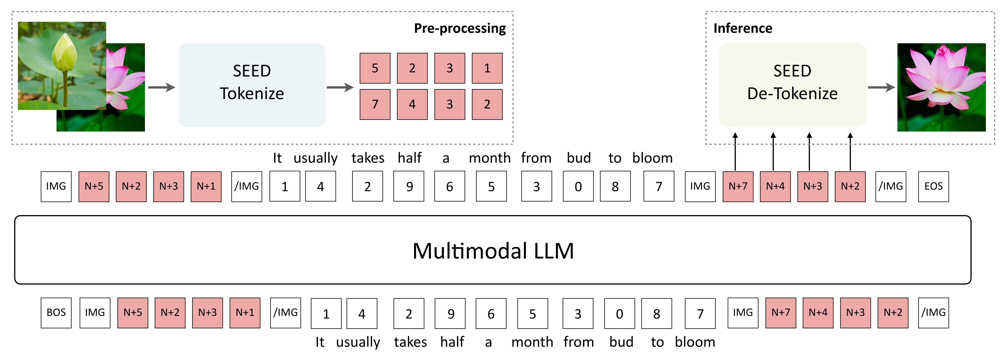

# Training Config
## Conda env
```bash
conda env create -f seed.yaml
``` 

## SEED Tokenizer Training
```bash
CUDA_VISIBLE_DEVICES=0 python train_v7_unified.py cfg_path=configs/training/stage<1,2>/<config>.yaml
``` 

# Original README
## Brief Introduction

It is recommended to check out our [papers](#citation) for technical details.

### :speech_balloon: What can SEED-LLaMA do?


**SEED-LLaMA** is capable of both multimodal comprehension and generation, exhibiting compositional emergent abilities such as multi-turn in-context multimodal generation, acting like your AI assistant. [[Compare to SOTA]](https://ailab-cvc.github.io/seed/seed_llama_compare.html) [[More examples on X]](https://twitter.com/ge_yixiao/status/1710509538238157069?s=20)

<!-- We present **SEED-LLaMA** by large-scale pretraining and instruction tuning on the interleaved textual and visual data, which demonstrates impressive performance on a broad range of multimodal comprehension and generation tasks. More importantly, SEED-LLaMA has exhibited **compositional emergent abilities** such as multi-turn in-context multimodal generation, acting like your **AI assistant**. -->

### :bulb: How does SEED-LLaMA achieve it?


The core of SEED-LLaMA is the tailored **SEED** tokenizer, which properly quantized visual signals into discrete visual tokens, capturing necessary semantics while being produced under 1D causal dependence. [[SEED-2 vs. SEED-1]](https://ailab-cvc.github.io/seed/seed_llama.html)

<!-- ### Compositional Emergent Ability
**Multi-turn in-context image and text generation.**


**Compositional image generation.**
 -->

<!-- ### SEED Tokenizer v2
In SEED tokenizer v2, the generation embedding is aligned with the **image embedding** (1 token) of [unCLIP SD](https://huggingface.co/stabilityai/stable-diffusion-2-1-unclip), and can be decoded to realistic images with the unCLIP-SD-UNet. In SEED tokenizer v1, we train a visual tokenizer through aligning the **generation embeddings** with the text embeddings (77 tokens) of [SD](https://github.com/CompVis/stable-diffusion), and the generation embeddings can be decoded to images with the SD-UNet. The below figure shows the visual comparison of the reconstructed images between SEED tokenizer v2 (the third row) and SEED tokenizer v1 (the second row). We can observe that the images reconstructed by SEED tokenizer v2 can better preserve the visual information of the original images. The semantic representations of texts can not fully preserve the rich visual information of images.
 -->

<!-- ### Pretraining
We perform multimodal autoregressive pretraining on interleaved visual and textual data for SEED-LLaMA. Visual inputs are pre-processed into discrete tokens to conserve computational resources. Given the multimodal discrete sequence, a unified next-word-prediction objective is employed. During inference, visual codes are decoded into a realistic image by SEED De-Tokenization.
 -->

## Usage

### Dependencies
- Python >= 3.8 (Recommend to use [Anaconda](https://www.anaconda.com/download/#linux))
- [PyTorch >= 1.11.0](https://pytorch.org/)
- NVIDIA GPU + [CUDA](https://developer.nvidia.com/cuda-downloads)

### Installation
Clone the repo and install dependent packages

  ```bash
  git clone https://github.com/AILab-CVC/SEED.git
  cd SEED
  pip install -r requirements.txt
  ```

    
### Model Weights
We release the pretrained SEED Tokenizer and De-Tokenizer, pretrained and instruction tuned SEED-LLaMA-8B and SEED-LLaMA-14B in [SEED Hugging Face](https://huggingface.co/AILab-CVC/SEED).

- Check the SEED tokenizer weights in [AILab-CVC/seed-tokenizer-2](https://huggingface.co/AILab-CVC/seed-tokenizer-2)
- Check the SEED LLaMA(8B) weights in [AILab-CVC/seed-llama-8b-sft](https://huggingface.co/AILab-CVC/seed-llama-8b-sft)
- Check the SEED LLaMA(14B) weights in [AILab-CVC/seed-llama-14b-sft](https://huggingface.co/AILab-CVC/seed-llama-14b-sft)

<!-- Please download the checkpoints and save under the folder `./pretrained`.

```bash
cd pretrained   # SEED/pretrained
git lfs install
git clone https://huggingface.co/AILab-CVC/SEED
mv SEED/* ./
``` -->

The model weights of unCLIP SD-UNet which are used to reconstruct the image will be downloaded automatically.

<!-- To reconstruct the image from the SEED visual codes using unCLIP SD-UNet, please download the pretrained [unCLIP SD](https://huggingface.co/stabilityai/stable-diffusion-2-1-unclip).  -->

<!-- To reconstruct the image from the SEED visual codes using unCLIP SD-UNet, please download the pretrained [unCLIP SD](https://huggingface.co/stabilityai/stable-diffusion-2-1-unclip).
Rename the checkpoint directory to **"diffusion_model"** and create a soft link to the "pretrained/seed_tokenizer" directory.

```bash
# SEED/pretrained
git lfs install
git clone https://huggingface.co/stabilityai/stable-diffusion-2-1-unclip
mv stable-diffusion-2-1-unclip seed_tokenizer/diffusion_model
``` -->


### Inference for visual tokenization and de-tokenization
To discretize an image to 1D visual codes with causal dependency, and reconstruct the image from the visual codes using the off-the-shelf unCLIP SD-UNet:

```bash
cd ..   # SEED/ 
python scripts/seed_tokenizer_inference.py
```
### Inference for SEED-LLaMA
Given that SEED-LLaMA-8B is based on Vicuna-7B and SEED-LLaMA-14B based on LLaMA2-Chat-13B, we use Vicuna-7B's ("USER:", "ASSISTANT:") and LLaMA2-Chat-13B's ([INST] [/INST]) prompts for respective instruction tuning.

```bash
# Inference for SEED-LLaMA-8B
python scripts/seed_llama_inference_8B.py
```

```bash
# Inference for SEED-LLaMA-14B
python scripts/seed_llama_inference_14B.py
```


### Launching Gradio Demo of SEED-LLaMA-14B Locally 
1. Building the local demo of SEED-LLaMA-14B currently requires **single 24GB** GPU.

```bash
# SEED/
# in first terminal
bash scripts/start_backend_14b.sh
# in second terminal
bash scripts/start_frontend_14b.sh
``` 

2. Building the local demo of SEED-LLaMA-8B currently requires **single 16GB** GPU.

```bash
# SEED/
# in first terminal
bash scripts/start_backend_8b.sh
# in second terminal
bash scripts/start_frontend_8b.sh
``` 
